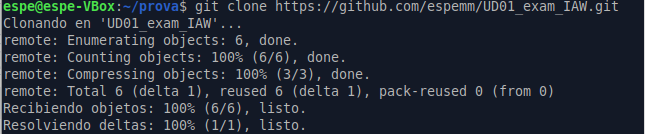
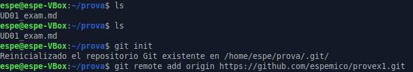
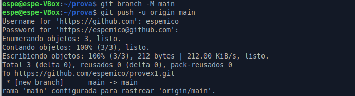
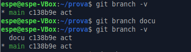
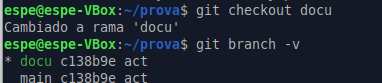
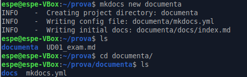
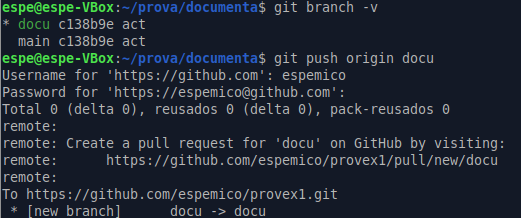
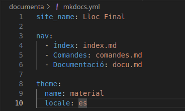
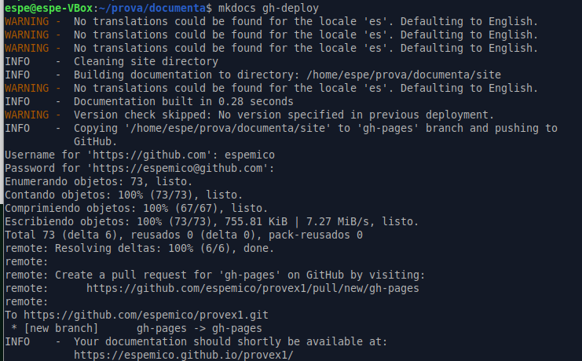

# Documentació del procés

- clonació i creació del repositori
- creació i gestió de rames 
- creació, gestió i publicació del projecte mkdocs

## Clonar

## Crear repositori

## Enllaçar repositori

## Branca nova

## Projecte mkdocs

## Documentació

## Desplegament

## Arxiu pdf

